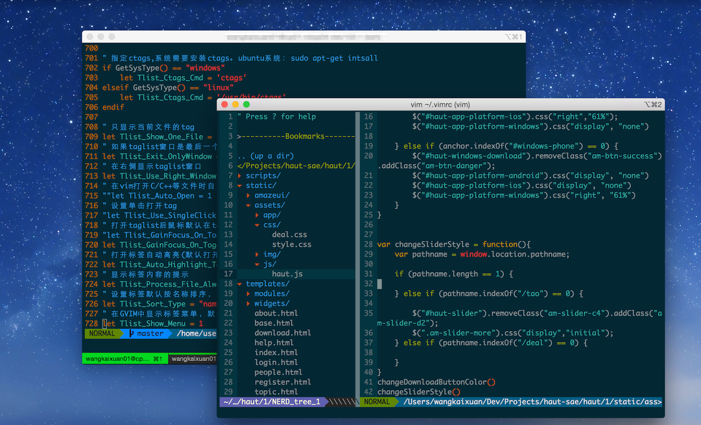

 


# Intruction  

PS: If you are a jumbo user, this vimrc suits you very much! see `install.sh`.

1.Preinstalled plugins（YouCompleteMe is disabled）：

```vim
" let Vundle manage Vundle, required
Plugin 'gmarik/Vundle.vim'

" plugin on GitHub repo
Plugin 'tpope/vim-fugitive'
Plugin 'scrooloose/nerdtree'
Plugin 'Lokaltog/vim-powerline'
Plugin 'stephenmckinney/vim-solarized-powerline'
Plugin 'kien/rainbow_parentheses.vim'
Plugin 'Yggdroot/indentLine'
Plugin 'pangloss/vim-javascript'
Plugin 'altercation/vim-colors-solarized'
"Plugin 'Valloric/YouCompleteMe'
Plugin 'L9'
Plugin 'txt.vim'
Plugin 'Syntastic'
Plugin 'taglist.vim'
Plugin 'neocomplcache'
```

2.Auto complete new file header. suport `C++/C`, `Python`, `Java`, `Shell`, you can add another programming languages suport.  

```vim  

""""""""""""""""""""""""""""""""""""""""""""""""""""""""""""""
"                   User-definded setting                    "
""""""""""""""""""""""""""""""""""""""""""""""""""""""""""""""
let g:krc_author = "your name"
let g:krc_email = "your email address"
let g:krc_copyright = "your Copyright type"
" your file description when you create a new file.
let g:krc_description = ""

```
example:  

```bash  

➜  krc git:(master) vim test.py
➜  krc git:(master) ✗ cat test.py
#!/usr/bin/env python
# -*- coding: utf-8 -*-
'''
@File Name:    test.py
@Author:       kehr
@Mail:         kehr.china@gmail.com
@Created Time: Sat, 04/04/2015, 03:12:43 AM
@Copyright:    GPL 2.0
@Description:
'''

```

**Read the `vimrc` file to get more features. It's worthwhile to do this. :smile:**

# Required  
 * vim >= 7.3
 * git 

# Install    

**Step1:**
  Make sure you prepared vim and git envoriment.

**Step2:**

Install Vundle

```bash
 git clone https://github.com/gmarik/Vundle.vim.git ~/.vim/bundle/Vundle.vim
```
**Step3:**

Get the vimrc file 

```bash
  curl -L https://raw.githubusercontent.com/kehr/krc/master/vimrc > $HOME/.krc 
```
**Step4:**

Set your default `vimrc` file

```bash
alias vim='vim -u ~/.krc'
```
Install vim plugin. open your vim editor and type the command below.

```bash  
:PluginInstall
```

So esay! :)

finished ! 
