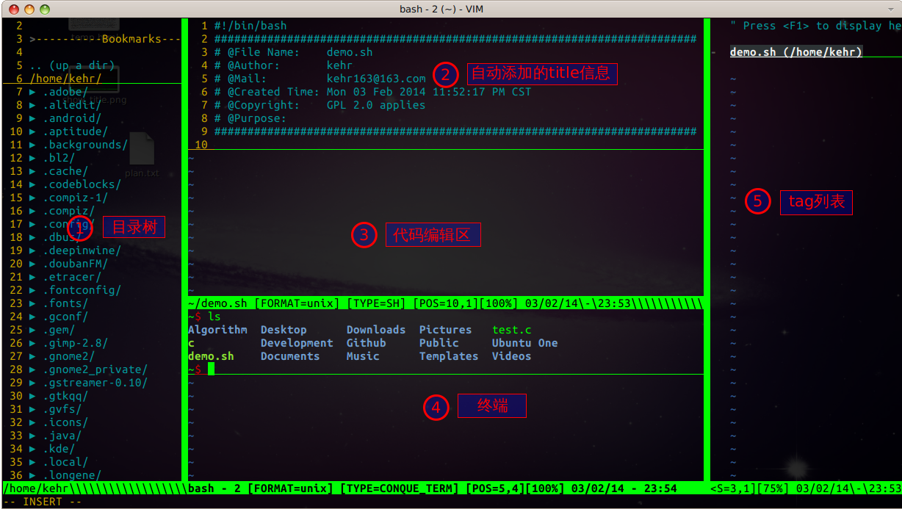
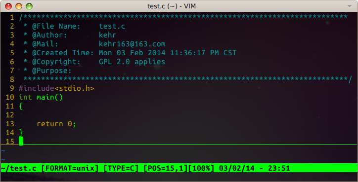
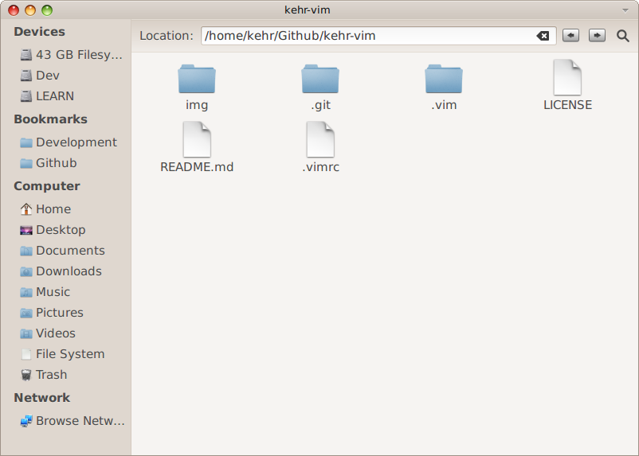

kehr-vim
========

##我的vim配置文件。##
<a href="" target="_blank"></a>
###1. 介绍说明：###

本项目是我目前使用vim的一些配置。初学时借鉴了网上的配置代码，后来对整体的配置做了整理，并添加了更多的功能。

原本home目录下只有`.vimrc`一个文件，并没有`.vim`目录。所有的配置，包括插件的配置都写在`.vimrc`文件中。随着配置代码的增加，导致该文件越来而来越大。后来在网上看到一些帖子，于是就把代码给分离了。插件的配置单独放在一个配置文件里，一个插件一个配置文件，在`.vimrc`中通过`source`连接进来，像这样：`source ~/.vim/vimfiles/nerdtree.conf`。  
####1.1 功能特性####
1. 移动当前行或多行  
`Normal`模式下`Ctrl+j`移动当前行到下1行,`Ctrl+k` 移动当前行到上1行  
`Visual`模式下`Ctrl+j`移动当前所选行到下1行,`Ctrl+k` 移动当前所选行到上1行

2. 复制当前行  
在`normal`模式下，按下`Ctrl+up`键（`up`键就是`↑`），会复制当前行到下一行，光标随之下向下移动一行，并保存

3. 删除当前行  
在`normal`模式下，按下`Ctrl+d`键 ，删除光标所在行 。

4. vim剪贴板共享  
`normal`模式下，按下 `ctrl+a`，复制全文  
`virtual`模式下，按下 `Ctrl+c`，复制所选中内容  
`normal`模式下，按下`Ctrl+p`，粘贴系统剪切板内容  

5. 在vim中打开终端  
`normal`模式下，<F4>打开或关闭终端

6. 编译运行当前文件  
`normal`模式下，<F5>编译并运行当前编辑的文件

7. 开启目录树  
`normal`模式下，<F6>打开或关闭目录树

8. 开启Taglist  
`normal`模式下，<F7>打开或关闭Taglist

9. 自动生成文件模板和版权声明
在终端中使用vim创建文件，`vim test.c`，会在新文件中自动添加标头  
例如，c文件的标头：    
<a href="" target="_blank"></a>  
目前支持自动生成标头的文件类型有：`c`、`cpp`、`java`、`python`、`shell`。
10. 快捷保存文件  
`normal`模式下，`Ctrl+w` 保存文件  

11. 自动补全括号、单引号、双引号  

...

####1.2 已安装的插件有：####
1. `taglist`
<pre>用于显示tag的插件。        下载地址：http://www.vim.org/scripts/script.php?script_id=273</pre>  
2. `NERD_tree`
<pre>用于显示目录的插件。       下载地址：http://www.vim.org/scripts/script.php?script_id=1658</pre>  
3. `neocomplcache`
<pre>用于代码补全的插件。       下载地址：http://www.vim.org/scripts/script.php?script_id=2620</pre>  
4. `conque_term`
<pre>用于在vim中显示控制台的插件。下载地址：http://www.vim.org/scripts/script.php?script_id=2771</pre>  
5. `txt`
<pre>用于自动探测文本类型的插件。 下载地址：http://www.vim.org/scripts/script.php?script_id=1532</pre>  

这些插件的配置都放在`.vim/vimfiles/`目录下

####1.3 `.vim`的目录结构如下：####
<pre>
.vim
├── autoload
│   ├── conque_term
│   │   ├── conque_globals.py
│   │   ├── conque.py
│   │   ├── conque_screen.py
│   │   ├── conque_sole_communicator.py
│   │   ├── conque_sole.py
│   │   ├── conque_sole_shared_memory.py
│   │   ├── conque_sole_subprocess.py
│   │   ├── conque_sole_wrapper.py
│   │   ├── conque_subprocess.py
│   │   └── conque_win32_util.py
│   ├── conque_term.vim
│   ├── neocomplcache
│   │   ├── async_cache.vim
│   │   ├── cache.vim
│   │   ├── commands.vim
│   │   ├── complete.vim
│   │   ├── context_filetype.vim
│   │   ├── filters
│   │   │   ├── converter_abbr.vim
│   │   │   ├── converter_case.vim
│   │   │   ├── converter_delimiter.vim
│   │   │   ├── converter_nothing.vim
│   │   │   ├── converter_remove_next_keyword.vim
│   │   │   ├── matcher_fuzzy.vim
│   │   │   ├── matcher_head.vim
│   │   │   ├── matcher_old.vim
│   │   │   ├── sorter_length.vim
│   │   │   ├── sorter_nothing.vim
│   │   │   └── sorter_rank.vim
│   │   ├── filters.vim
│   │   ├── handler.vim
│   │   ├── helper.vim
│   │   ├── init.vim
│   │   ├── mappings.vim
│   │   ├── sources
│   │   │   ├── buffer_complete.vim
│   │   │   ├── dictionary_complete.vim
│   │   │   ├── filename_complete.vim
│   │   │   ├── filename_include.vim
│   │   │   ├── include_complete.vim
│   │   │   ├── member_complete.vim
│   │   │   ├── omni_complete.vim
│   │   │   ├── syntax_complete.vim
│   │   │   ├── tags_complete.vim
│   │   │   ├── vim_complete
│   │   │   │   ├── autocmds.dict
│   │   │   │   ├── command_args.dict
│   │   │   │   ├── command_completions.dict
│   │   │   │   ├── command_prototypes.dict
│   │   │   │   ├── command_replaces.dict
│   │   │   │   ├── commands.dict
│   │   │   │   ├── features.dict
│   │   │   │   ├── functions.dict
│   │   │   │   ├── helper.vim
│   │   │   │   ├── mappings.dict
│   │   │   │   ├── options.dict
│   │   │   │   └── variables.dict
│   │   │   └── vim_complete.vim
│   │   ├── util.vim
│   │   └── variables.vim
│   ├── neocomplcache.vim
│   ├── unite
│   │   └── sources
│   │       ├── file_include.vim
│   │       └── neocomplcache.vim
│   ├── vital
│   │   ├── _08a462e
│   │   │   ├── data
│   │   │   │   └── list.vim
│   │   │   ├── prelude.vim
│   │   │   └── system
│   │   │       └── cache.vim
│   │   ├── _08a462e.vim
│   │   └── neocomplcache.vital
│   └── vital.vim
├── doc
│   ├── conque_term.txt
│   ├── neocomplcache.txt
│   ├── NERD_tree.txt
│   ├── taglist.txt
│   ├── tags
│   └── txt.txt
├── nerdtree_plugin
│   ├── exec_menuitem.vim
│   └── fs_menu.vim
├── plugin
│   ├── conque_term.vim
│   ├── neocomplcache
│   │   ├── buffer_complete.vim
│   │   ├── dictionary_complete.vim
│   │   ├── include_complete.vim
│   │   ├── syntax_complete.vim
│   │   └── tags_complete.vim
│   ├── neocomplcache.vim
│   ├── NERD_tree.vim
│   └── taglist.vim
├── syntax
│   ├── conque_term.vim
│   ├── nerdtree.vim
│   └── txt.vim
├── vest
│   └── test-neocomplcache.vim
└── vimfiles
    ├── autocomplete.conf
    ├── compilefile.conf
    ├── conqueterm.conf
    ├── neocomplcache.conf
    ├── nerdtree.conf
    ├── showtitle.conf
    └── taglist.conf
</pre>
    
`19 directories, 93 files`


###2. 安装使用：###

1.将本项目中的 `.vimrc`文件 和 `.vim` 目录 复制到当前用户的家目录下。注意先备份你自己的 `.vimrc` 文件 和 `.vim` 目录。

```bash
#备份你的.vimrc文件
cp  ~/.vimrc  ~/.vimrc.backup
#备份你的 .vim 目录
cp  -r ~/.vim  ~/.vim.backup
#配置本项目的.vimrc
cp  -r .vim .vimrc  ~/
```
###3. 注意：###
3.1 由于`.vim`目录 和 `.vimrc` 前面都有 `.` ，所以在你下载到本地的目录里文件是隐藏的。如果你的操作系统是ubuntu，使用nautilus文件管理器，只需在项目目录下按下Ctrl+H 就可一显示隐藏文件。
<a href="" target="_blank"></a>
其它操作系统，参见对应系统的设置说明。
 
3.2 终端配置，命令`ls -al` 显示当前目录下所有文件。
  
3.3 目前基本不在windows下用vim，具体配置日后补上。

3.4 `1.3节.vim的目录结构`是使用命令 `tree -n .vim` 生成的。`tree`命令在ubuntu下使用`sudo apt-get install tree`安装,具体使用方法参见命令`tree --help`结果。  

3.5 目前配置的一些功能，没有一一列出使用方法。你可以参见我目前的blog：http://blog.csdn.net/kehrwang 上面有部分使用介绍,详细的使用介绍我随后会补充上。
