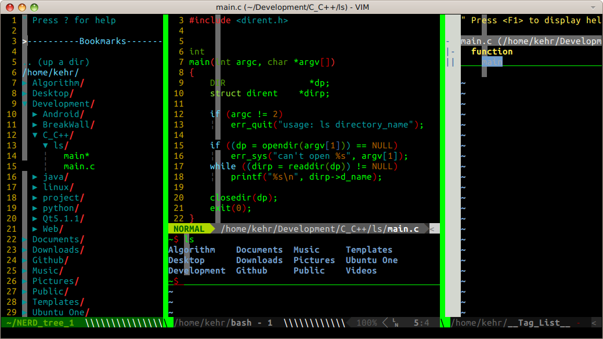
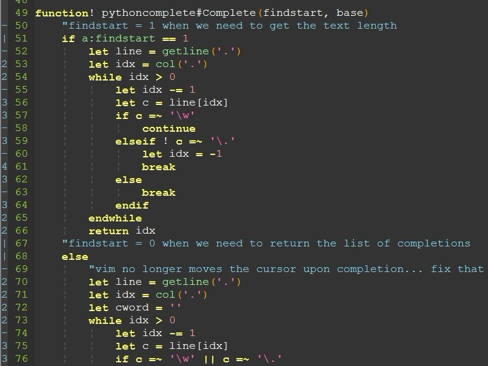
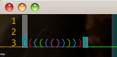

kehr-vim
========

##我的vim配置文件。##
<a href="" target="_blank"></a>  
2014-1-10更新后效果：   
<a href="" target="_blank"></a>
###1. 介绍说明：###
===================
本项目是我目前使用vim的一些配置。初学时借鉴了网上的配置代码，后来对整体的配置做了整理，并添加了更多的功能。
插件的配置单独放在一个配置文件里，一个插件一个配置文件，在`.vimrc`中通过`source`连接进来，像这样：`source ~/.vim/vimfiles/nerdtree.conf`。  
####1.1 功能特性
1. 移动当前行或多行  
`Normal`模式下`Ctrl+j`移动当前行到下1行,`Ctrl+k` 移动当前行到上1行  
`Visual`模式下`Ctrl+j`移动当前所选行到下1行,`Ctrl+k` 移动当前所选行到上1行 (有点问题，慎用 ×_× )

2. 复制当前行  
在`normal` or `insert` 模式下，按下`Ctrl+up`键（`up`键就是`↑`），会复制当前行到下一行，光标随之下向下移动一行

3. 复制选中的多行  
在`virtual`模式下，选中多行后，按下`Ctrl+Up`，会将选中的多行复制到当前选中区域的上面。

4. 删除当前行  
在`normal` or `insert` 模式下，按下`Ctrl+d`键 ，删除光标所在行 。

5. 删除选中的行  
在 `virtual` 模式下，选中多行，按下`Ctrl+d`键 或者 字母 `d`，删除所选多行 。

6. 空格  
在 `normal` 模式下，按下`空格键`在光标之前插入`空格`

7. 删除  
在 `normal` 模式下，按下 `删除键——BackSpace` 删除光标之前的字符

8. vim剪贴板共享  
`normal` or `virtual`模式下，按下 `ctrl+a`，全文选中  
`virtual`模式下，按下 `Ctrl+c`，复制所选中内容  
`normal`模式下，按下`Ctrl+p`，粘贴系统剪切板内容到光标所在行的下一行 

9. 在vim中打开终端  
`normal`模式下，`<F4>`打开或关闭终端

10. 编译运行当前文件  
`normal`模式下，`<F5>`编译并运行当前编辑的文件

11. 开启目录树  
`normal`模式下，`<F2>`打开或关闭目录树  
`insert` 模式下，`Ctrl+<F2>`打开或关闭目录树

12. 开启Taglist  
`normal`模式下，`<F12>`打开或关闭Taglist

13. 自动生成文件模板和版权声明
在终端中使用vim创建文件，`vim test.c`，会在新文件中自动添加标头  
例如，c文件的标头：    
<a href="" target="_blank"></a>  
目前支持自动生成标头的文件类型有：`c`、`cpp`、`java`、`python`、`shell`。
14. 快捷保存文件  
`normal`或`insert`模式下，`Ctrl+w` 保存文件  

15. 自动补全括号、单引号、双引号  

...

####1.2 已安装的插件有：
1. `vundle`
<pre>用于管理所有安装的插件      插件地址：https://github.com/gmarik/Vundle.vim</pre>
2. `taglist`
<pre>用于显示tag的插件。        插件地址：http://www.vim.org/scripts/script.php?script_id=273</pre>  
3. `NERDtree`
<pre>用于显示目录的插件。       插件地址：http://www.vim.org/scripts/script.php?script_id=1658</pre>  
4. `neocomplcache`
<pre>用于代码补全的插件。       插件地址：http://www.vim.org/scripts/script.php?script_id=2620</pre>  
5. `Conque-Shell`
<pre>用于在vim中显示控制台的插件。插件地址：http://www.vim.org/scripts/script.php?script_id=2771</pre>  
6. `txt`
<pre>用于自动探测文本类型的插件。 插件地址：http://www.vim.org/scripts/script.php?script_id=1532</pre>  
7. `powerline`
<pre>显示一个漂亮的状态栏。     插件地址：https://github.com/Lokaltog/vim-powerline</pre>
这个插件的配置我已经写好存放于`~/.vim/vimfiles/powerline.conf`，需要安装一个字体才能正常显示漂亮的效果。   
字体使用的是`ubuntu-mono-powerline-ttf`，地址：https://github.com/pdf/ubuntu-mono-powerline-ttf，按照文档说明安装即可。  
效果如下：  
<a href="" target="_blank"></a>  
8. `indentline`
<pre>用于显示缩进线的插件    插件地址：https://github.com/Yggdroot/indentLine</pre>
效果（官方图片）：  
<a href="" target="_blank"></a>  

9.`rainbow_parentheses`
<pre>用于括号颜色增强        插件地址：https://github.com/kien/rainbow_parentheses.vim   </pre>  
效果：  
<a href="" target="_blank"></a>  
10. 这些插件的配置都放在`.vim/vimfiles/`目录下

####1.3 `.vim`的目录结构如下：####
<pre>
`2014-1-10 update`：    
.vim
├── autoload
├── bundle
│   ├── Conque-Shell
│   │   ├── autoload
│   │   │   ├── conque_term
│   │   │   │   ├── conque_globals.py
│   │   │   │   ├── conque.py
│   │   │   │   ├── conque_screen.py
│   │   │   │   ├── conque_sole_communicator.py
│   │   │   │   ├── conque_sole.py
│   │   │   │   ├── conque_sole_shared_memory.py
│   │   │   │   ├── conque_sole_subprocess.py
│   │   │   │   ├── conque_sole_wrapper.py
│   │   │   │   ├── conque_subprocess.py
│   │   │   │   └── conque_win32_util.py
│   │   │   └── conque_term.vim
│   │   ├── doc
│   │   │   ├── conque_term.txt
│   │   │   └── tags
│   │   ├── plugin
│   │   │   └── conque_term.vim
│   │   ├── README
│   │   └── syntax
│   │       └── conque_term.vim
│   ├── indentLine
│   │   ├── after
│   │   │   └── plugin
│   │   │       └── indentLine.vim
│   │   ├── doc
│   │   │   ├── indentLine.txt
│   │   │   └── tags
│   │   └── README.md
│   ├── neocomplcache
│   │   ├── autoload
│   │   │   ├── neocomplcache
│   │   │   │   ├── async_cache.vim
│   │   │   │   ├── cache.vim
│   │   │   │   ├── commands.vim
│   │   │   │   ├── complete.vim
│   │   │   │   ├── context_filetype.vim
│   │   │   │   ├── filters
│   │   │   │   │   ├── converter_abbr.vim
│   │   │   │   │   ├── converter_case.vim
│   │   │   │   │   ├── converter_delimiter.vim
│   │   │   │   │   ├── converter_nothing.vim
│   │   │   │   │   ├── converter_remove_next_keyword.vim
│   │   │   │   │   ├── matcher_fuzzy.vim
│   │   │   │   │   ├── matcher_head.vim
│   │   │   │   │   ├── matcher_old.vim
│   │   │   │   │   ├── sorter_length.vim
│   │   │   │   │   ├── sorter_nothing.vim
│   │   │   │   │   └── sorter_rank.vim
│   │   │   │   ├── filters.vim
│   │   │   │   ├── handler.vim
│   │   │   │   ├── helper.vim
│   │   │   │   ├── init.vim
│   │   │   │   ├── mappings.vim
│   │   │   │   ├── sources
│   │   │   │   │   ├── buffer_complete.vim
│   │   │   │   │   ├── dictionary_complete.vim
│   │   │   │   │   ├── filename_complete.vim
│   │   │   │   │   ├── filename_include.vim
│   │   │   │   │   ├── include_complete.vim
│   │   │   │   │   ├── member_complete.vim
│   │   │   │   │   ├── omni_complete.vim
│   │   │   │   │   ├── syntax_complete.vim
│   │   │   │   │   ├── tags_complete.vim
│   │   │   │   │   ├── vim_complete
│   │   │   │   │   │   ├── autocmds.dict
│   │   │   │   │   │   ├── command_args.dict
│   │   │   │   │   │   ├── command_completions.dict
│   │   │   │   │   │   ├── command_prototypes.dict
│   │   │   │   │   │   ├── command_replaces.dict
│   │   │   │   │   │   ├── commands.dict
│   │   │   │   │   │   ├── features.dict
│   │   │   │   │   │   ├── functions.dict
│   │   │   │   │   │   ├── helper.vim
│   │   │   │   │   │   ├── mappings.dict
│   │   │   │   │   │   ├── options.dict
│   │   │   │   │   │   └── variables.dict
│   │   │   │   │   └── vim_complete.vim
│   │   │   │   ├── util.vim
│   │   │   │   └── variables.vim
│   │   │   ├── neocomplcache.vim
│   │   │   ├── unite
│   │   │   │   └── sources
│   │   │   │       ├── file_include.vim
│   │   │   │       └── neocomplcache.vim
│   │   │   ├── vital
│   │   │   │   ├── _08a462e
│   │   │   │   │   ├── data
│   │   │   │   │   │   └── list.vim
│   │   │   │   │   ├── prelude.vim
│   │   │   │   │   └── system
│   │   │   │   │       └── cache.vim
│   │   │   │   ├── _08a462e.vim
│   │   │   │   └── neocomplcache.vital
│   │   │   └── vital.vim
│   │   ├── doc
│   │   │   ├── neocomplcache.txt
│   │   │   └── tags
│   │   ├── plugin
│   │   │   ├── neocomplcache
│   │   │   │   ├── buffer_complete.vim
│   │   │   │   ├── dictionary_complete.vim
│   │   │   │   ├── include_complete.vim
│   │   │   │   ├── syntax_complete.vim
│   │   │   │   └── tags_complete.vim
│   │   │   └── neocomplcache.vim
│   │   ├── README
│   │   ├── README.md
│   │   └── vest
│   │       └── test-neocomplcache.vim
│   ├── nerdtree
│   │   ├── autoload
│   │   │   └── nerdtree.vim
│   │   ├── doc
│   │   │   ├── NERD_tree.txt
│   │   │   └── tags
│   │   ├── lib
│   │   │   └── nerdtree
│   │   │       ├── bookmark.vim
│   │   │       ├── creator.vim
│   │   │       ├── key_map.vim
│   │   │       ├── menu_controller.vim
│   │   │       ├── menu_item.vim
│   │   │       ├── opener.vim
│   │   │       ├── path.vim
│   │   │       ├── tree_dir_node.vim
│   │   │       └── tree_file_node.vim
│   │   ├── nerdtree_plugin
│   │   │   ├── exec_menuitem.vim
│   │   │   └── fs_menu.vim
│   │   ├── plugin
│   │   │   └── NERD_tree.vim
│   │   ├── README.markdown
│   │   └── syntax
│   │       └── nerdtree.vim
│   ├── rainbow_parentheses.vim
│   │   ├── autoload
│   │   │   └── rainbow_parentheses.vim
│   │   ├── plugin
│   │   │   └── rainbow_parentheses.vim
│   │   └── readme.md
│   ├── taglist.vim
│   │   ├── doc
│   │   │   ├── taglist.txt
│   │   │   └── tags
│   │   ├── plugin
│   │   │   └── taglist.vim
│   │   └── README
│   ├── txt.vim
│   │   ├── COPYING
│   │   ├── doc
│   │   │   ├── tags
│   │   │   └── txt.txt
│   │   ├── README
│   │   ├── README.orig
│   │   └── syntax
│   │       └── txt.vim
│   ├── vim-powerline
│   │   ├── autoload
│   │   │   ├── Pl
│   │   │   │   ├── Colorscheme.vim
│   │   │   │   ├── Hi.vim
│   │   │   │   ├── Match.vim
│   │   │   │   ├── Mod.vim
│   │   │   │   ├── Parser.vim
│   │   │   │   ├── Segment.vim
│   │   │   │   └── Theme.vim
│   │   │   ├── Pl.vim
│   │   │   └── Powerline
│   │   │       ├── Colorschemes
│   │   │       │   ├── default.vim
│   │   │       │   ├── solarized16.vim
│   │   │       │   ├── solarized256.vim
│   │   │       │   └── solarized.vim
│   │   │       ├── Functions
│   │   │       │   ├── ft_man.vim
│   │   │       │   ├── fugitive.vim
│   │   │       │   ├── hgrev.vim
│   │   │       │   └── syntastic.vim
│   │   │       ├── Functions.vim
│   │   │       ├── Matches.vim
│   │   │       ├── Segments
│   │   │       │   ├── ctrlp.vim
│   │   │       │   ├── ft_man.vim
│   │   │       │   ├── fugitive.vim
│   │   │       │   ├── hgrev.vim
│   │   │       │   ├── rvm.vim
│   │   │       │   ├── syntastic.vim
│   │   │       │   ├── tagbar.vim
│   │   │       │   └── virtualenv.vim
│   │   │       ├── Segments.vim
│   │   │       └── Themes
│   │   │           ├── default.vim
│   │   │           ├── solarized16.vim
│   │   │           └── solarized256.vim
│   │   ├── doc
│   │   │   ├── Powerline.txt
│   │   │   └── tags
│   │   ├── fontpatcher
│   │   │   ├── fontpatcher
│   │   │   ├── PowerlineSymbols.sfd
│   │   │   └── README.rst
│   │   ├── plugin
│   │   │   └── Powerline.vim
│   │   ├── Powerline_default_default_compatible.cache
│   │   ├── Powerline_default_default_fancy.cache
│   │   ├── Powerline_default_default_unicode.cache
│   │   ├── Powerline_solarized256_default_unicode.cache
│   │   └── README.rst
│   └── vundle
│       ├── autoload
│       │   ├── vundle
│       │   │   ├── config.vim
│       │   │   ├── installer.vim
│       │   │   └── scripts.vim
│       │   └── vundle.vim
│       ├── doc
│       │   ├── tags
│       │   └── vundle.txt
│       ├── LICENSE-MIT.txt
│       ├── README.md
│       └── test
│           ├── files
│           │   └── test.erl
│           ├── minirc.vim
│           └── vimrc
├── README
└── vimfiles
    ├── autocomplete.conf
    ├── basicSetting.conf
    ├── compilefile.conf
    ├── conqueterm.conf
    ├── indentline.conf
    ├── keyMapSetting.conf
    ├── neocomplcache.conf
    ├── nerdtree.conf
    ├── powerline.conf
    ├── rainbow_parentheses.conf
    ├── showtitle.conf
    └── taglist.conf
</pre>
`63 directories, 180 files`


###2. 安装使用：
===================

1.将本项目中的 `.vimrc`文件 和 `.vim` 目录 复制到当前用户的家目录下，即可直接使用。注意先备份你自己的 `.vimrc` 文件 和 `.vim` 目录。

```bash
#备份你的.vimrc文件
cp  ~/.vimrc  ~/.vimrc.backup
#备份你的 .vim 目录
cp  -r ~/.vim  ~/.vim.backup
#配置本项目的.vimrc
cp  -r .vim .vimrc  ~/
```
###3. 注意：

3.1  由于`.vim`目录 和 `.vimrc` 前面都有 `.` ，所以在你下载到本地的目录里文件是隐藏的。如果你的操作系统是ubuntu，使用nautilus文件管理器，只需在项目目录下按下Ctrl+H 就可一显示隐藏文件。
<a href="" target="_blank"></a>

其它操作系统，参见对应系统的设置说明。
 
3.2 终端配置，命令`ls -al` 显示当前目录下所有文件。
  
3.3 目前基本不在windows下用vim，具体配置日后补上。

3.4 `1.3节.vim的目录结构`是使用命令 `tree -n .vim` 生成的。`tree`命令在ubuntu下使用`sudo apt-get install tree`安装,具体使用方法参见命令`tree --help`结果。  

###4.感谢 
* 谢谢v2ex的两位V友 @wklken 和 @TankyWoo 的帮助。 

###5.结束

* 最后更新时间：2014-1-10  
* 我的Blog,正在搭建中：http://www.ikehr.com